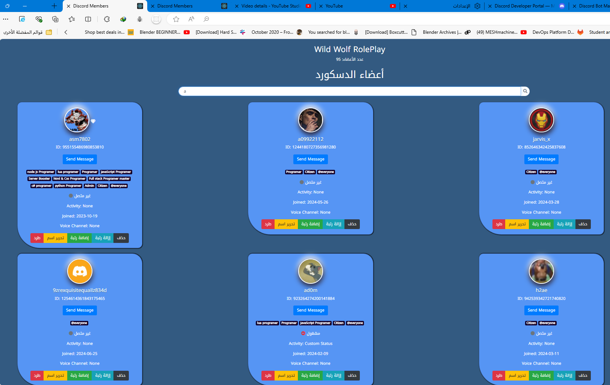
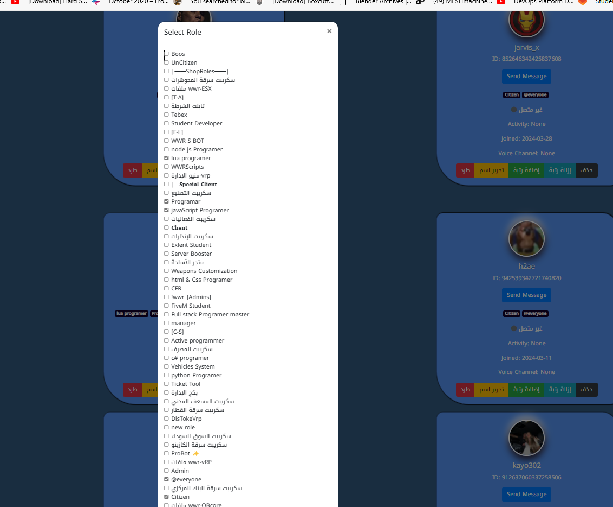

# Discord Management Application

[العربية](#التطبيق-إدارة-الديسكورد) | [English](#discord-management-application-1)

## التطبيق إدارة الديسكورد

هذا التطبيق هو أداة قوية لإدارة خوادم Discord باستخدام Node.js وExpress. يوفر واجهة رسومية سهلة الاستخدام لإدارة الأعضاء والأدوار وإرسال الرسائل.

### المميزات

- عرض قائمة الأعضاء مع معلومات تفصيلية
- إدارة الأدوار (إضافة/إزالة)
- إرسال رسائل خاصة للأعضاء
- حظر/طرد الأعضاء
- تعديل أسماء الأعضاء

### لقطات الشاشة


*واجهة إدارة الأعضاء*


*واجهة إدارة الأدوار*

### المتطلبات

- Node.js (الإصدار 14 أو أحدث)
- npm (مدير حزم Node.js)

### التثبيت

1. قم بنسخ المستودع:
   ```
   git clone https://github.com/your-username/discord-management-app.git
   ```

2. انتقل إلى مجلد المشروع:
   ```
   cd discord-management-app
   ```

3. قم بتثبيت الاعتماديات:
   ```
   npm install
   ```

4. قم بإنشاء ملف `config.json` في المجلد الرئيسي وأضف توكن البوت ومعرف الخادم الخاص بك:
   ```json
   {
     "token": "your-bot-token",
     "guildId": "your-guild-id"
   }
   ```

### الاستخدام

1. قم بتشغيل الخادم:
   ```
   node server.js
   ```

2. افتح المتصفح وانتقل إلى `http://localhost:3000`

3. استخدم الواجهة الرسومية لإدارة خادم Discord الخاص بك

### الدعم

إذا واجهت أي مشاكل أو كان لديك أي أسئلة، يرجى الانضمام إلى خادم Discord الخاص بنا للدعم:

[انضم إلى خادم الدعم](https://discord.gg/ZZC8JVuyb6)

---

## Discord Management Application

This application is a powerful tool for managing Discord servers using Node.js and Express. It provides an easy-to-use graphical interface for managing members, roles, and sending messages.

### Features

- Display member list with detailed information
- Manage roles (add/remove)
- Send private messages to members
- Ban/kick members
- Edit member nicknames

### Screenshots


*Member management interface*


*Role management interface*

### Requirements

- Node.js (version 14 or later)
- npm (Node.js package manager)

### Installation

1. Clone the repository:
   ```
   git clone https://github.com/your-username/discord-management-app.git
   ```

2. Navigate to the project folder:
   ```
   cd discord-management-app
   ```

3. Install dependencies:
   ```
   npm install
   ```

4. Create a `config.json` file in the root folder and add your bot token and guild ID:
   ```json
   {
     "token": "your-bot-token",
     "guildId": "your-guild-id"
   }
   ```

### Usage

1. Start the server:
   ```
   node server.js
   ```

2. Open a browser and go to `http://localhost:3000`

3. Use the graphical interface to manage your Discord server

### Support

If you encounter any issues or have any questions, please join our Discord server for support:

[Join Support Server](https://discord.gg/ZZC8JVuyb6)